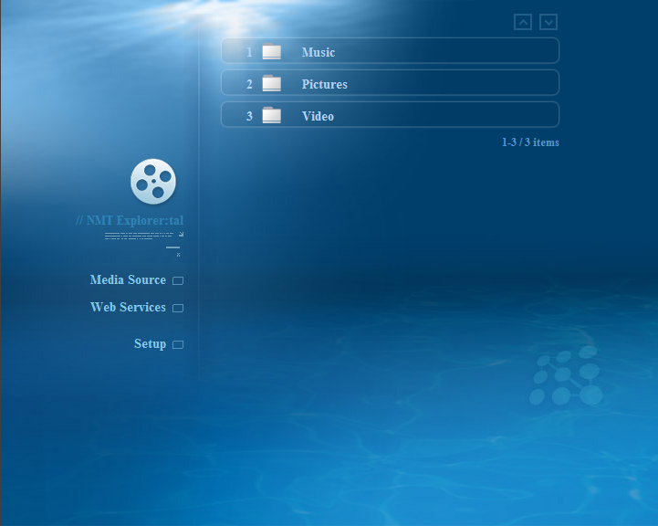

About NMT Explorer:
===================
This is a nifty web application I developed for myself, as an alternative to myiHome.  

It's targeted for advanced users, who wish to utilize a server oriented and flexible solution compared to myiHome.  

Requirements:
-------------
+ IIS 6 / 7 (Windows XP Pro x64 / Windows Home Server / Windows Server 2003 / Windows Server 2008)  
  + IIS 5.1 (Windows XP Pro) does not *officially* support files > 4GB, but can be used as well.  
  + IIS 7.5 RTM / RC are not compatible with the Popcorn Hour A-100 (HEAD requests containing Range header will result in HTTP status code 416), it's possible to use Beta http.sys v6.1.7000.0 and pre-Beta static.dll v6.1.6801.0  
+ .Net Framework 2.0  

Limitations:
------------
+ Does not include UPnP capabilities, you can use [upnp2http](http://www.networkedmediatank.com/showthread.php?tid=8283) for UPnP support. (recommended).
+ Virtual directories are hidden, unless a physical directory with the same name exist (the content of the virtual will be listed, this is similar to the default IIS browsing behavior).
+ Virtual directory listing support require that you run the application under the default web site.

Features:
---------
1. Runs under IIS, which is a windows service. (you don't have to login to start the server)
2. fully customizable themes though html templates and configuration files. (including language settings)
3. Automatic detection of NMT resolution, and selection of theme resolution accordingly (SD/HD)
4. Open-Source, you can modify the code to fit your needs (C# / ASP.Net 2.0)
5. Support moviejukebox (YAMJ), (an icon will be shown on the homepage if a folder named 'MovieJukebox' exist in the website root directory)
6. Video, Audio and Image files are listed together.
7. Playlist Support: clicking on an audio/image file, will start a playlist of files in the current directory with the same type (audio/image), starting from the file that have been clicked.
8. excluding files / directories based on exact or partial text match.

Notes:
------
1. The default skin has been heavily borrowed from myiHome, (I would appreciate if someone can make a proper "Directory Listing" and "Movie Jukebox" Icons for the home page.
2. look at the "web.config" and "theme\deepblue\theme.config" and "theme\deepblue\template\" for settings and customization.

Installation notes: (for experienced users)
-------------------------------------------
1. Install .Net Framework 2.0 / IIS (if not already installed)  
2. Enable Asp.Net 2.0 web service extension.  
3. Extract the application files to the root of the default web site.  
   (usually C:\inetpub\wwwroot)  
4. by default, IIS will only serve files with 'known' extensions,  
   you can make IIS serve every type of file by setting 'application/octet-stream' mime-type for extension:'*' (Properties > Http headers > Mime types)  
+ Note: make sure this setting does not apply to the 'MovieJukebox' directory, or IIS will server css files as 'application/octet-stream' (instead of 'text/css') and the css won't load on the Popcorn Hour.  
5. Add virtual directories linking to your media directories, create physical directories with the same name. (so that they will be seen by NmtExplorer)  
6. Install upnp2http and configure it (or manually add the website to the list of services in the PCH)  

Screenshot: ("deepblue" theme, SD):

Contact:
--------
If you have any question, feel free to contact me.  
Tal Aloni <tal.aloni.il@gmail.com>
